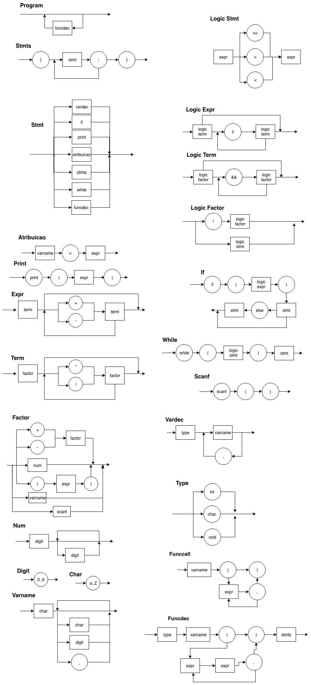

# logcompiler

### Rodando o programa

O programa foi feito com python 3.6 em mente, não existe garantia de funcionamento completo em para outras versões do mesmo.

Além disso, o programa exige a depende da existência da biblioteca [argparse](https://docs.python.org/3/library/argparse.html).

Para executar o programa, basta rodar o arquivo [/src/main/py](/src/main.py). O arquivo aceita a flag `--file` como argumento (opcional). Como padrão, ele utiliza o arquivo de entrada [/examples/example.c](/examples/example.c).

### Diagrama Sintático




### EBNF

```
program = type, 'main', '(', ')', stmts;
type = ('int' | 'char' | 'void');
logic_stmt = expr, ('==' | '>' | '<'), expr;
logic_expr = logic_term, {'||', logic_term};
logic_term = logic_factor, {'&&', logic_factor};
logic_factor = ('!', logic_factor) | logic_stmt;
if = 'if', '(', logic_expr, ')', stmt, ['else', stmt];
while = 'while', '(', logic_expr, ')', stmt;
stmts = '{', stmt, ';', {stmt, ';'}, '}';
stmt = print | atribuicao | stmts | if | while | vardec;
vardec = type, varname, {',', varname};
atribuicao = varname, '=', expr;
print = 'printf', '(', expr, ')';
expr = term, {('+' | '-'), term};
term = factor, {('*' | '/'), factor};
factor = varname | (('+' | '-') factor) | (num) | ('(', expr, ')') | scanf;
scanf = 'scanf', '(', ')';
num = digit, {digit};
varname = char, {(char | digit | '_')};
digit = (0..9);
char = (a..Z);
```
